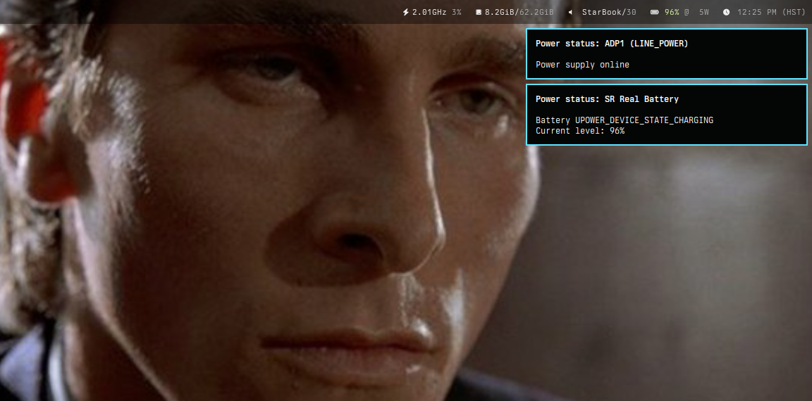
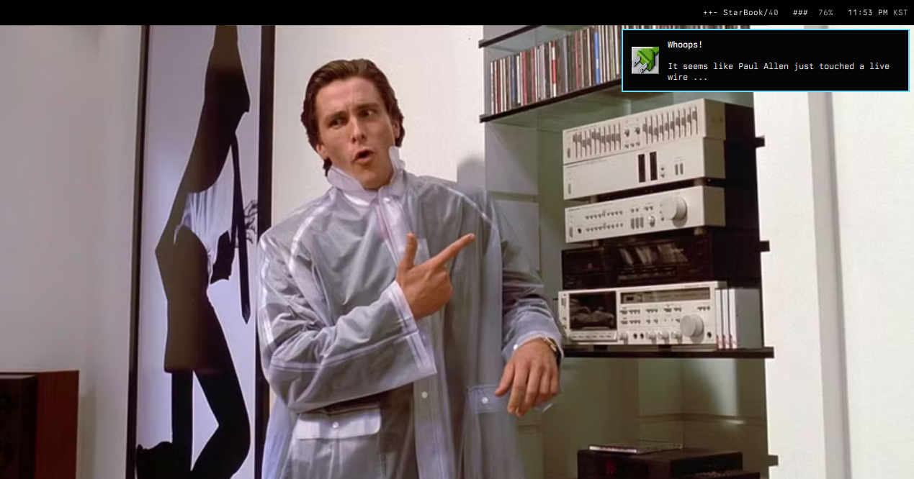

# zpoweralertd



[](https://xn--gckvb8fzb.com/contact/)

`zpoweralertd` _gives you power notifications as you need them_. Paul Allen has
mistaken it for `poweralertd`, which seems logical, because `zpoweralertd` also
depends on UPower and a notification daemon such as `mako`, and in fact does the
same exact thing `poweralertd` does, and it also has a penchant for D-Bus
integration and lightweight code. `poweralertd` and `zpoweralertd` even support
the same command-line arguments, although `zpoweralertd` is slightly more
modern.

> If you couldn't tell by now, `zpoweralertd` is a Zig rewrite and drop-in
> replacement of [`poweralertd`](https://github.com/kennylevinsen/poweralertd/).

## How to build

```sh
zig build
```

(requires Zig 0.15.1+)

## Usage

Simply run `zpoweralertd` to start receiving desktop notifications about power
events like battery state changes, warning levels, and power supply
connect/disconnect:

```sh
zpoweralertd
```

In Sway and similar desktop environments, you can copy-paste the following to
the end of the configuration file (e.g. `~/.config/sway/config`) to
automatically launch `zpoweralertd` in the background:

```cfg
# zpoweralertd
# https://codeberg.org/mrus/zpoweralertd
exec zpoweralertd
```

### Options

The following flags are available:

| Flag                              | Description                                              |
| --------------------------------- | -------------------------------------------------------- |
| `-h`                              | Show help message                                        |
| `-i <device_type>`                | Ignore a device type (can be specified multiple times)   |
| `-s`                              | Ignore events at startup                                 |
| `-S`                              | Only monitor power supplies                              |
| `-v`                              | Show version number                                      |
| `-V`                              | Verbose output                                           |
| `--when <status> <pct> <command>` | Execute a shell command at a specific battery percentage |

Almost all flags are the exact same ones supported by `poweralertd`. However,
`zpoweralertd` also implements flags that `poweralertd` does not support:

#### `--when`

The `--when` flag allows executing arbitrary shell commands when the battery
reaches a specific percentage, either by charging or discharging. This is a
feature unique to `zpoweralertd` and `poweralertd` does not support it.

The flag takes three arguments:

1. `status`: Either `charged` (aliases: `charge`, `charging`) or `discharged`
   (aliases: `discharge`, `discharging`)
2. `percentage`: The battery level (number from 0 to 100)
3. `command`: The shell command to execute

For `discharged`, the command fires when the battery percentage drops **to or
below** the given value. For `charged`, it fires when the percentage **reaches
or exceeds** it. The command fires once when the condition is met and will only
fire again after the condition has cleared and been met again.

The flag can be specified multiple times to define different rules:

```sh
zpoweralertd \
  --when discharged 5 "doas halt" \
  --when discharged 15 "notify-send 'Battery critical!'" \
  --when charged 99 "notify-send 'Almost full!'"
```

This makes it possible to build a complete power management policy directly
through command-line arguments, from low-battery warnings to automatic shutdown,
without any external scripts or configuration files. The benefit this has over,
let's say, `udev` rules, is that script execution as the current user is
significantly easier, less hacky and poses fewer overall security risks, as
`zpoweralertd` does not need to (read: **should not**) be run in privileged
mode.

## Footnotes



> You like Huey Lewis and the News?

> Well, you can always be thinner... look better.

> I like to dissect old C software. Did you know I'm utterly insane?
